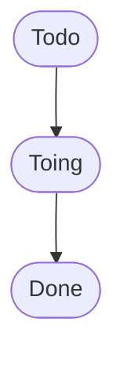
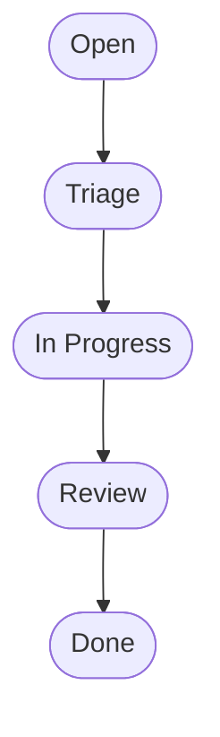
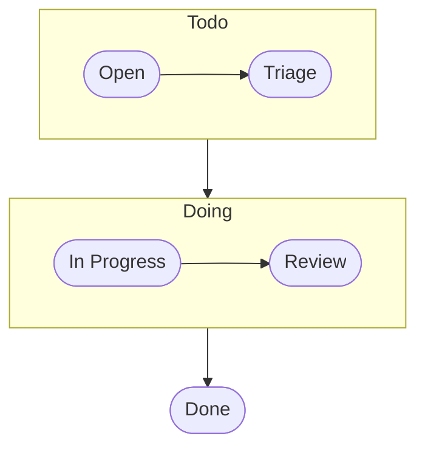
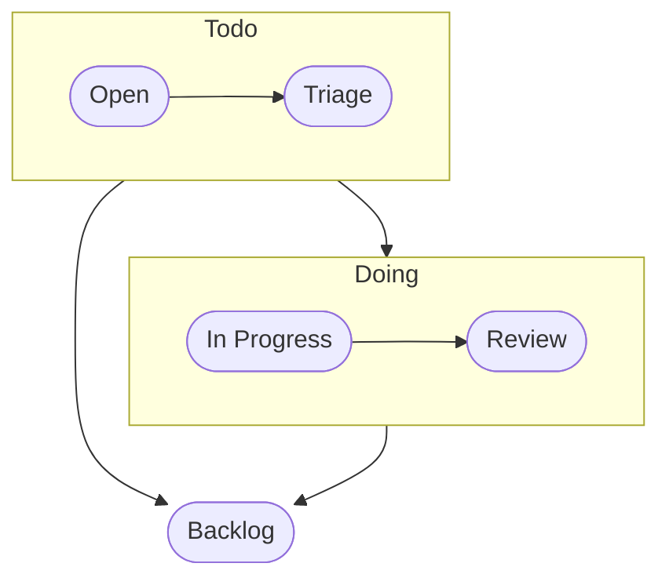

## Status

Status is a single select field in project board to indicate
what is the current stage of a specific issue.

1. Open
2. Triage
3. Progess
4. Review
5. Done
6. Backlog

A typical personal task has the following 3 status,

However in a teamwork setup, extra status have to be added to reflect
team decisions,
<!---

-->

  
Or at any moment, the best decision of current status could be NOT
Todo, which is "Backlog" pending on future decisions.

## Priority

Priority is a single select field in project board to indicate
a ranking of importance and urgency

- High
- Medium
- Low

## Deliverable

Deliverable is a single select field in project board to indicate
result of tasks. Each deliverable is certain format of documents, e.g.

- CRD: Customer Requirement
- TRD: Technical Requirement
- ID: Industrial Design
- SCH: Schematic design, Electronic BOM, and datasheets
- PCB: PCB design
- FW: Firmware
- TC: Test Case
- BOM: Mechanical Build Materials

<!---

### Open
- Assignee: issue reporter
- Time block: 1 week
- Key information: 
  - Product Code
  - S/N
  - Precise bug or defect symptom
  - Tracking Number 

### Triage 
- Assignee: vendor QA lead
- Time block: 10 days
- Determine:
  - Assignee
  - Priority
  - Duplicates

### RCA 
- Assignee: vendor engineer
- Time block: depending on priority
- Key deliverables:
  - Vendor defect reports, or
  - Manufacture reports

### Fix 
- Assignee: vendor engineer
- Key deliverables:
  - Design changes, or
  - SOP changes
  - Pull request
  - Supporting documentation

### Done 
- Assignee: issue reporter
- It's issue reporter's decision to close or not.

## Github Project Fields 

- [Assignee](#gh-assignee)
- [Status](#gh-status)
- [Duplicate](#gh-duplicate)
- [Label](#gh-label)
- [Dates](#gh-date)

### Assignee 
- A single person who is responsible for the current status

### Duplicate 

- A text field to indicate this issue is a duplicate of another same issue. 
- Product Code: Issue ID

### Label 

- A multi-select text field to indicate what are deliverables for this task or issue
- A report must be labelled when in RCA 
- Label can be used for many different purpose as long as definitions in one project are consistent 

### Open, RCA Start and Fix Date 

- Date format fields to tracking time and status
- These field can also be used to generate meaningful performance indicator through filters, e.g. Q1 Open, Q2 Fix, etc. 

# Development Workflow 

To be able to divide and conquer and track incremental changes during development stage

- [Task](#dev-task)
- [Trackor](#dev-trackor)
- [Assignee](#dev-assignee)
- [Priorities](#dev-priorities)
- [Status](#dev-status)
- [Area](#dev-area)
- [Deliverable](#dev-deliverable)
- [Timelines](#dev-timelines)

## Task 

A single action item, e.g.

- Feature Request
- Bug Reports
- Test Case

A task may have a todo checklist.

## Trackor 

A group of action items or sub trackors, e.g.

- Situation Appraisals
- Release Notes
- Test Plans

The rule of divide-and-conquer:
- A trackor must have a list of tasks or smaller trackors
- A trackor or a task must have deliverables defined or lablled

## Assignee 

Each task or trackor must have a single person as assignee.

## Timelines 

Short term and long term goals,

- Roadmap
- Milestone
- Sprint
- Start date and target date

## Risk 

Risk should be assessed on a trackor or task with timeline, especially a critical path. And it should be regularly updated.

- On Track
- At Risk
- Blocked

# Change Management 

## General Guideline

Changes should be managed in an increasingly, more and more restrictive manner with more milestone achieved.

- Initially duing development, it serves more of a personal tracking tool for developers to exploring ideas and easily going back when ideas fail.
- After prototypes work, it serves more of building tool for developers to keeping building more things without breaking existing or impacting others.
- During preproduction or production stage, changes must be managed strictly to ensure solving problems not creating new problems or disastors.

- [ ] commit message
- [ ] branch
- [ ] reviews

## Design Package 

- [ ] folders
- [ ] releases

# Folder Structure and Ownership

# Owner's Responsibilities

## Track issues

- Create, triage and track issues or new features with github issue id
- Orgnize github issues ids in project tab with tech area and assignee shown

## Review commits

- Create a pull request to review any document change/commit
- Specify reviewers both in vendor side and FP side in that pull request
- Review commits in pull requests on timingly basis (2 days deadline)
  by pushing review button

## Maintain Deliverables

- Maintain good file structure in folder by following file and folder
  name conventions

-->