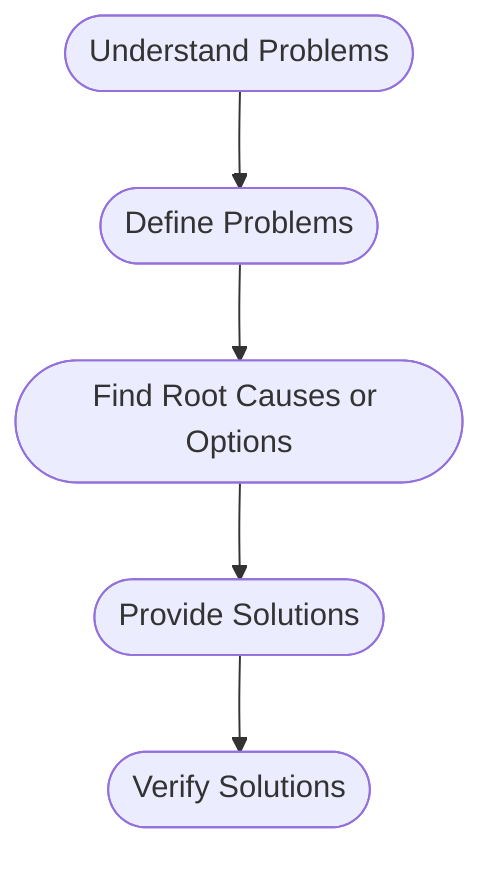
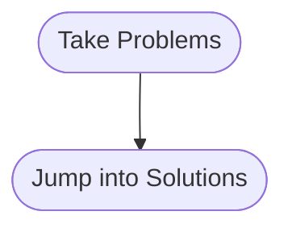
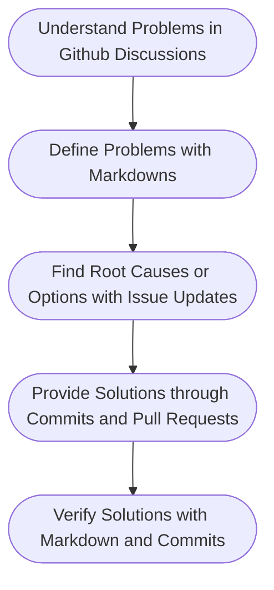
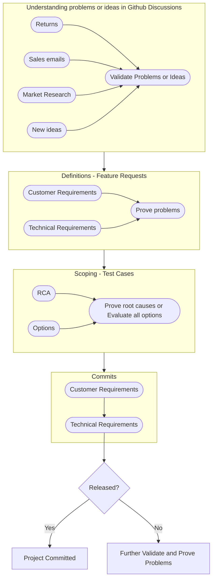
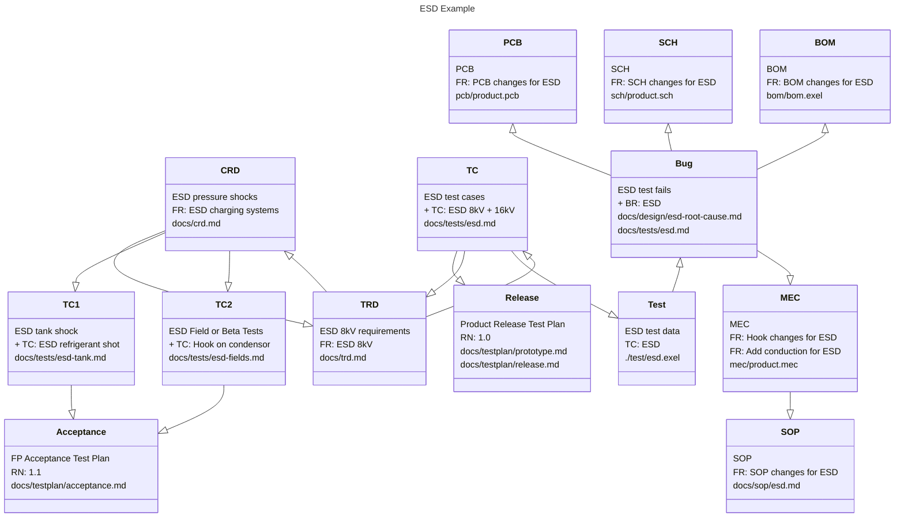

# Document workflow

## How to solve a problem?

Below is a common sense.

But too many times, people just do shortcuts,

If people take wrong problems and jump right into solutions, usually
it ends up with a much bigger problem.

## Basic Documentaion Flow in Github

All problems or ideas shoud start in a team-based Github discussion
area where all histories can be retained and topics can be categoried.

As long as the problems or idea is fully understand, it should go into
repo by transfering Discussion topics to repo issues, or create new
issues.

Our first goal here is to prove problems themselves and it is not to
provide solutions. We don't have this well-defined today. Here we need
version-controlled requirements.

Our second goal is to prove root causes and evaluate all options. Here
again it is not to provide solutions. Here we need version-controlled
tests and data. And provides better comment updates on root cause
analysis.

Once we understand root causes and evaluate possible options the best
solution speak itself. Changes in all areas must be identified and
tracked. 

Once we understand all changes in all areas, we can decide the scope
of project with ownership and deliverables defined.

## Example Document Flow

## Basic Guidelines

- Don't using emails to develop projects. Put everything in discussion
  area for a product/project if not sure;

- Update facts, data, logs or whatever new findings in a github issue which is
  a single source of truth. Don't only update status in the issue;

- Plan projects in discussion area. Don't plan that in github
  issues. The plan itself is not a deliverable and not source of
  truth;

- Use issue top comment box to preview the document changes you are proposing;

## Document Workflow in Github

??? Warning "Compliance"

    2 things are mandatory or required for compliance. One is all
    product ideas or tech topics must be registered in general
    discussions pending validation.One is all tech docs will be
    written by Markdown lauguage.

### Discussions

Any topic including ideas, suggestions, support requests, project
status and planning, technical Q&A, show off, release announcements,
etc., anythiny should be first registered in discussion.

This is to replace email traffic and increase visibility, so the whole
community knows what is going on, project participants can provide
early feedbacks, and deliverable owners have opportunities do more
upfront evaluations before actually committing into an ongoing
projects.

- Each vendor has only one discussion area;
- Topics are categoried in predefined categories;
- Topics are further grouped by labels or tags;
- No owner and change management requirements
- Any discussion is not in a project scope

### Issues

Github Issues are used to develop features and test cases, improve
designs, report bugs, validate problems, break down works, etc.,
facilitate teamwork, communications and reviews.

However, contents in issue thread don't have change management and
they cannot replace version controlled deliverables. We will regulate
issue usage in the following ways,

- Each issue has a single owner or assignee who owns or produce version controlled document;
- Each issue has a single target or deliverable, it cannot represent different deliverables;
- If one issue has multiple assignees or deliverables, specific issues must be created;
- Issue content in top box can be used to track document changes or used as copy-paste for markdown commits;
- Issue content in comment box must be addressed with "hide" options

### Docs and Binaries

We address issues by making changes to existing documents. In general,
changes in id designs, mechanical drawings, schematics, pcb, bom, bin,
datasheets, test data etc. are binaries, software changes are in its
own categary, and all other changes, e.g. requirements, designs,
reports, test cases are text based.

All docs (non binary or software) must be maintained in a docs folder.

Below is an ESD example, each block has github issue with one owner and
end docs defined.

