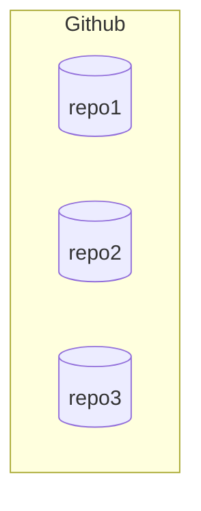
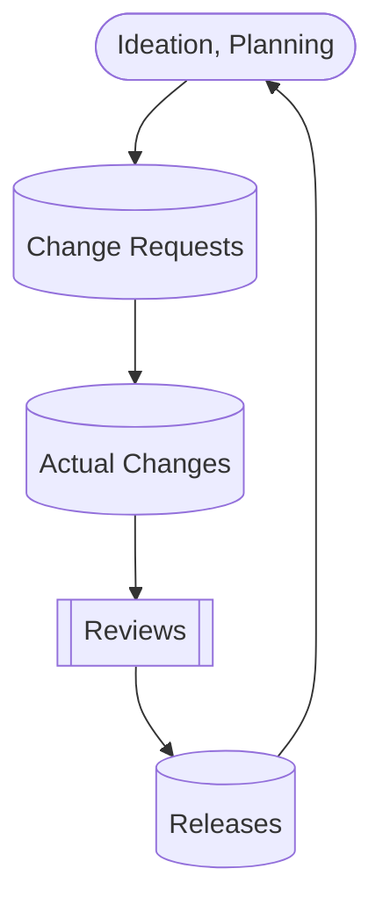
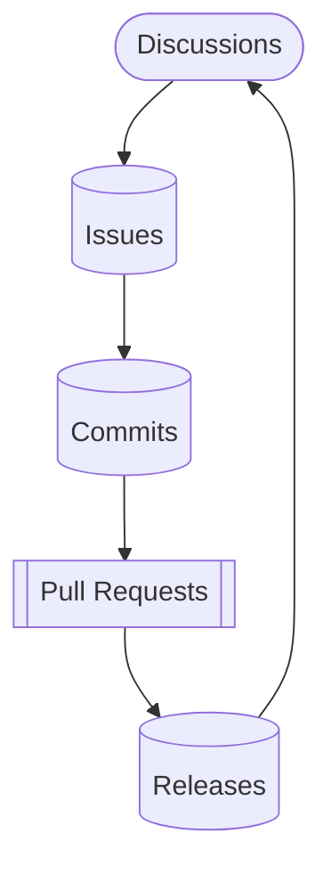

# Overview

## Repo

Github is a collection of cloud databases, called "repository", or "repo".

Each repo contains folders and files just like a regular file system.

## Organization

Only organization members and outside collebrators can access private
repos in an organization.  An organization is a billing unit for
privacy, security, storage, and many other paid features.

<!--Since our business
model relies on vendors and their developers, member permission
management is critical. Since Github has no hierarchy way to organize
repos, repo names must follow naming convention strictly.
-->

## Account

Every person who uses GitHub has their own account. That account is
created with an email which represents that individual and is his/her
identity in one or multiple organizations.

## Development Flow

## Github Terms

## Discussions

GitHub Discussions is a collaborative communication forum. Each new
discussion is an open-ended conversation, Q&A or poll.
